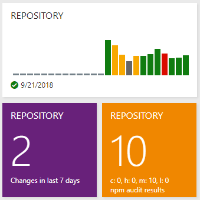

#  npm-audit-widget

Widget for Azure DevOps (TFS) Dashboard's for displaying npm audit results

## Install

https://marketplace.visualstudio.com/items?itemName=BrandonBoone.npm-audit-widget

## Build

1. Install [tfx-cli](https://github.com/Microsoft/tfs-cli): `npm i -g tfx-cli`
1. Install project dependencies: `npm install`
1. Build the project: `npm run build`
1. Package the project: `npm run package`

## Overview

See [overview.md](overview.md)

## Credits

- Logo: [virus by Ilsur Aptukov from the Noun Project](https://thenounproject.com/term/virus/209072/)
- Configuration Section: https://github.com/SWarnberg/BuildWarningsWidget/
- Build Tooling: https://github.com/reduxjs/redux
