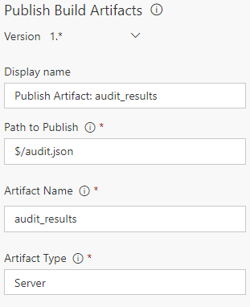

# About

npm audit widget is a Dashboard widget for Azure DevOps (TFS) Dashboard's that displays [npm audit](https://docs.npmjs.com/getting-started/running-a-security-audit) results.

## [NPM Severities](https://docs.npmjs.com/getting-started/about-audit-reports#severity)

- Critical:	Address immediately
- High:	Address as quickly as possible
- Moderate:	Address as time allows
- Low:	Address at your discretion

## Configuration

*Note: You must be on npm v6.1.0 or greater*

1. Create a [npm task](https://docs.microsoft.com/en-us/azure/devops/pipelines/tasks/package/npm?view=vsts) with the following arguments
    - working folder: `$/[path to application root (folder with package.json)]`
    - npm command: `audit`
    - arguments: `--json > audit.json`
      - Optional, use `--json > audit.json & exit 0` if you don't want the task to fail if audit returns security issues.

    

1. Create a [publish build artifacts task](https://docs.microsoft.com/en-us/azure/devops/pipelines/tasks/utility/publish-build-artifacts?view=vsts) with the following arguments
    - Path to Publish: `$/[path to application root (folder with package.json)]/audit.json`
    - Artifact Name: `audit_results`
    - Artifact Type: `Server`

    

1. Make sure the npm task comes before the publish task
    

## Credits

- Logo: [virus by Ilsur Aptukov from the Noun Project](https://thenounproject.com/term/virus/209072/)
